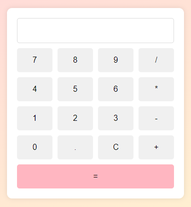

# Pastel Calculator 🌸🌼
A simple and visually pleasing calculator with pastel tones, created using HTML, CSS and JavaScript.



## Features

- Basic arithmetic operations (addition, subtraction, multiplication, division)
- Stylish pastel color theme

## How to Use

1. Clone the repository:
```bash
git clone https://github.com/seu-usuario/seu-repositorio.git
```

2. Open `index.html` in your preferred browser.

## Functionality
- **Numbers:** Click on the number buttons to input values.
- **Operators:** Use addition (+), subtraction (-), multiplication (*), and division (/) buttons.
- **Equal (=) Button:** Calculates the result.
- **Clear (C) Button:** Clears the input.

## Customization
Feel free to customize the colors and styles by editing the CSS variables in `styles.css`.

```css
:root {
  --color-pink: #ffd1dc;
  --color-yellow: #fffacd;
  --color-button-hover: #ffe4b5;
  --color-clear: #ffb6c1;
}
```
## Contributing
Contributions are welcome! Feel free to open issues or submit pull requests.

## License
This project is licensed under the [MIT License](LICENSE).

